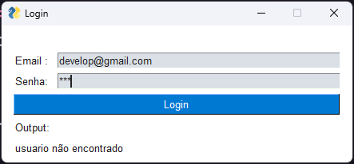

interface grafica com PySimpleGUI

## Projeto de Autenticação de Usuário com Interface Gráfica em Python utilizando PySimpleGUI

### Descrição:

O projeto "Autenticação de Usuário" é um aplicativo simples que utiliza os conceitos de módulos Python, interface gráfica com o PySimpleGUI e lógica de programação para criar um formulário de login. O objetivo do projeto é permitir que os usuários insiram seu e-mail e senha para acessar o sistema.

```py
while True:
    events, values = janela.read()
    if events == interface.WINDOW_CLOSED:
        break
    auth(janela, values)
```

O aplicativo consiste em uma janela de login que exibe campos para inserir o e-mail e a senha. Ao pressionar o botão "Login", o sistema verifica se o usuário existe e se a senha fornecida está correta.



Se o usuário existir e a senha estiver correta, uma mensagem de boas-vindas é exibida na própria janela de login, informando que o acesso foi concedido. Caso contrário, se o usuário não existir ou a senha estiver incorreta, uma mensagem de erro é exibida, notificando que o login falhou.

- O projeto utiliza conceitos fundamentais de programação, como a estrutura de condições (if/else) para verificar a validade do usuário e a senha.

Com essa aplicação simples, é possível aprender sobre a modularidade do Python ao organizar o código em diferentes arquivos para melhor reutilização, assim como a criação de uma interface gráfica amigável e interativa utilizando o PySimpleGUI. O projeto também explora conceitos de lógica de programação, como a tomada de decisões e a repetição de ações até que uma condição seja satisfeita.

- Em suma, o projeto "Autenticação de Usuário" combina conceitos de módulos Python, interface gráfica com PySimpleGUI, lógica de programação com condições e loop (while) para fornecer um formulário de login funcional, validando o acesso do usuário e fornecendo uma mensagem de boas-vindas em caso de sucesso.

Para inicia a aplicação basta fazer o clone do repositorio e colar o seguinte comando no terminal

    pip install PySimpleGUI
    python main.py

projeto criado para fins de estudo

    email: dev@gmail.com
    senha: 123
